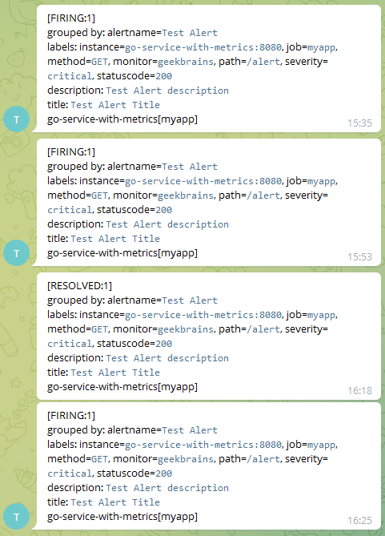
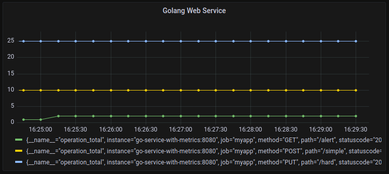

# ДЗ 01
## п. 1 Перенастроить репозиторий https://github.com/modeckrus/geekbrains для своего телеграмма
Репозиторий склонирован, исправлены пути импорта, внесены изменения в конфиги 
для взаимодействия с подконтрольным телеграм-ботом.  
Уведомления приходят успешно.

  

## п. 2 Добавить метод Put /hard который будет рендерить html страницу с `<h1>Hard</h1>`
В `main.go` добавляем handler для указанного метода и маршрута:
```go
r.HandleFunc("/hard", hardHandler).Methods(http.MethodPut)
```
Сама функция `hardHandler` использует шаблоны go для рендеринга html-страницы:
```go
func hardHandler(w http.ResponseWriter, r *http.Request) {
	fp := path.Join("templates", "hard.html")
	tmpl, err := template.ParseFiles(fp)
	if err != nil {
		http.Error(w, err.Error(), http.StatusInternalServerError)
		return
	}

	if err := tmpl.Execute(w, nil); err != nil {
		http.Error(w, err.Error(), http.StatusInternalServerError)
	}
}
```

## п. 3 Прикрепить скриншоты из Grafana.

