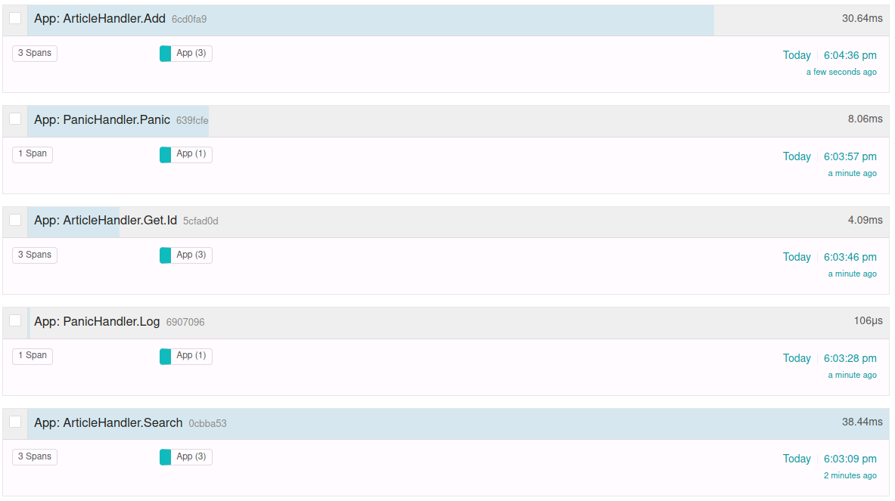
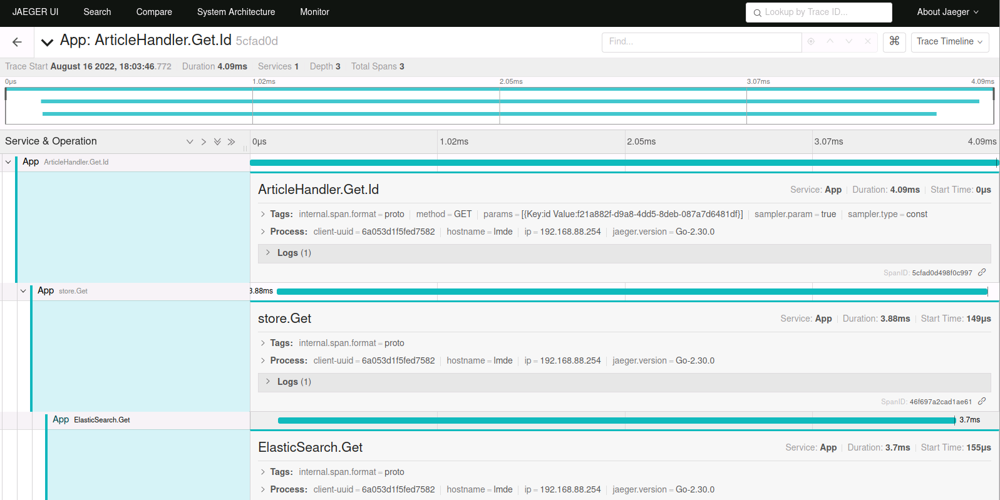
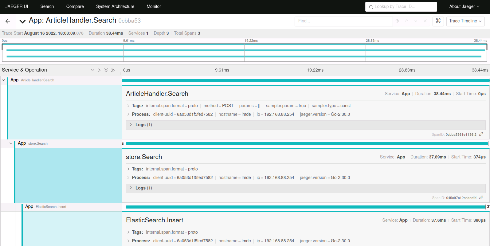
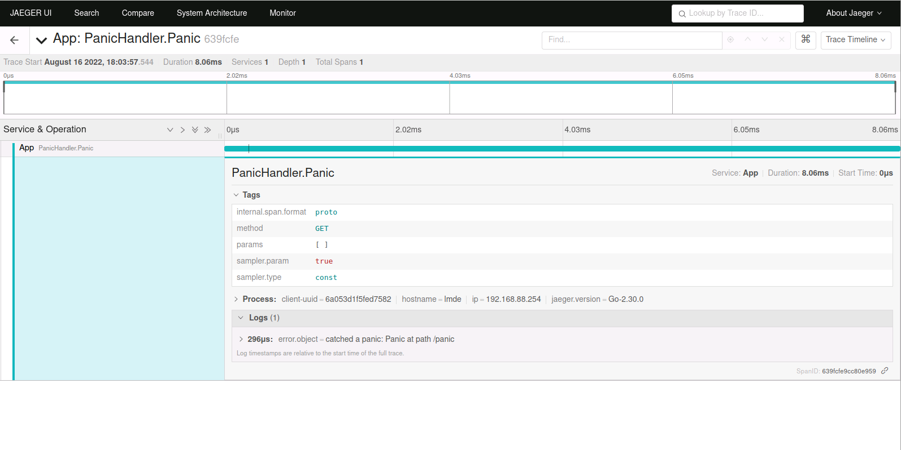

# ДЗ 03
## Модифицировать ветку lesson2 https://github.com/modeckrus/geekbrains и модифицировать ее используя пример из lesson3. 
В итоге должен быть zap logger вместо дефолтного, а также для всех методов появиться tracing(Jaeger).
Приложить скрины из Jaeger по каждому из запросов. В тегах должно быть видны параметры которые передаются в метод.  

Использовал ветку lesson02 из своего репозитория `https://github.com/ptsypyshev/go-observability`  
Связка с Jaeger работает.

Детальный скриншот по хэндлеру ArticleHandler.Add

Детальный скриншот по хэндлеру ArticleHandler.Id

Детальный скриншот по хэндлеру ArticleHandler.Search

Детальный скриншот по хэндлеру PanicHandler.Panic

Детальный скриншот по хэндлеру ArticleHandler.Log
